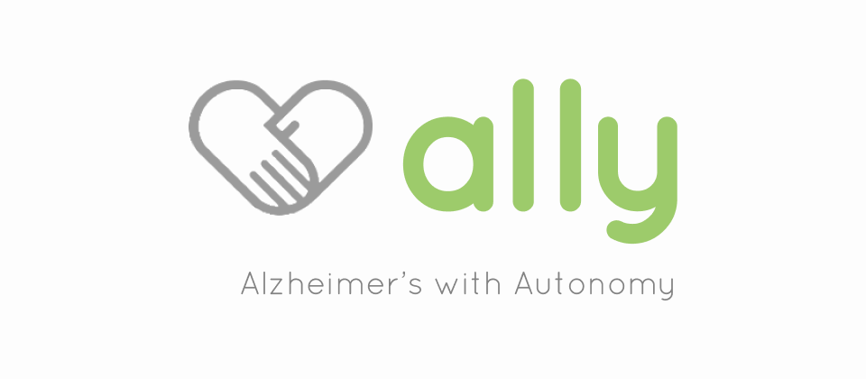
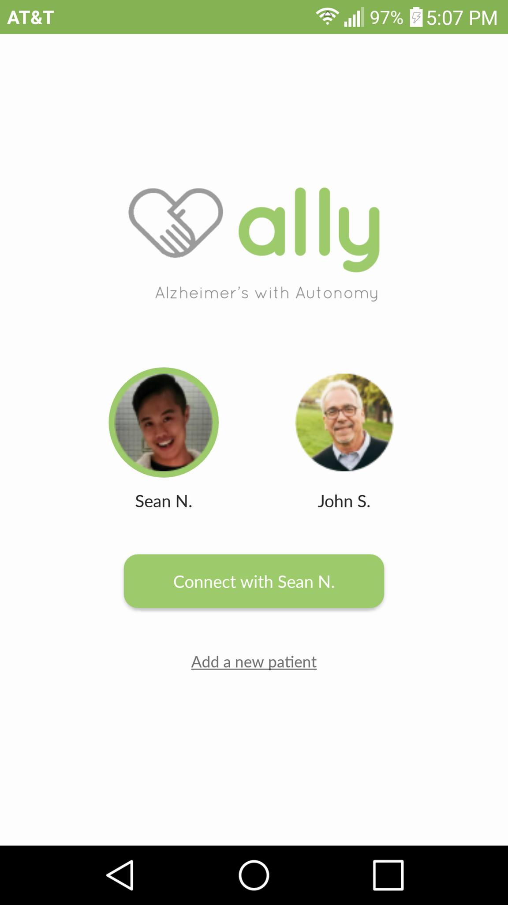
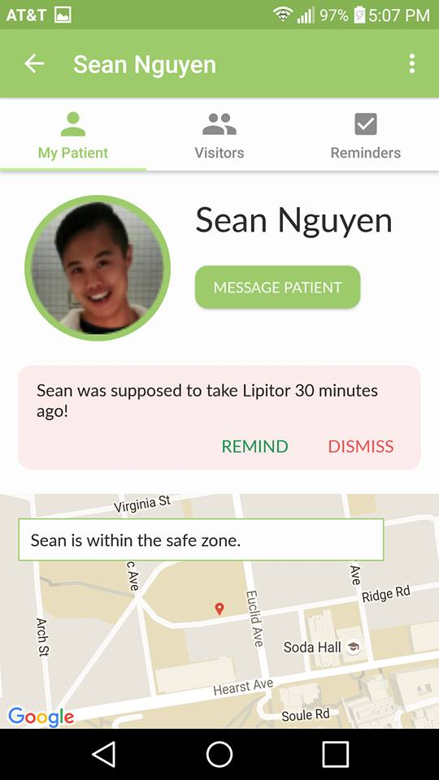
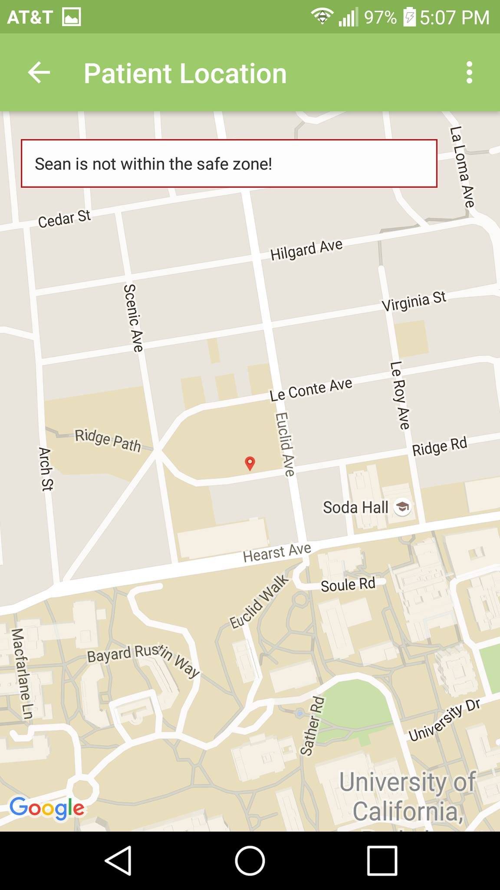
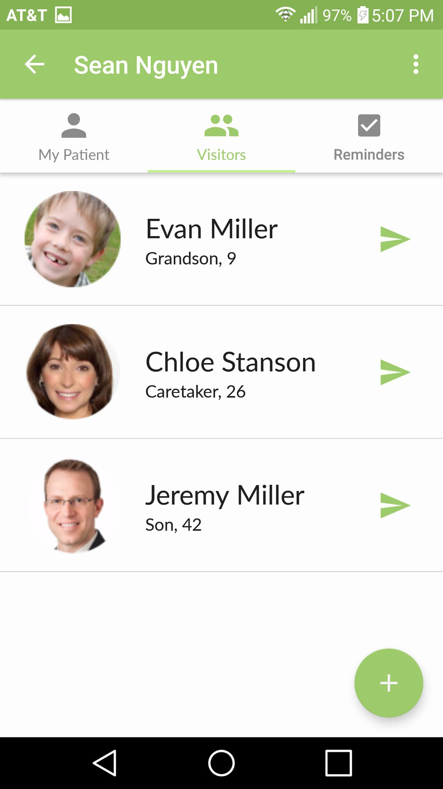
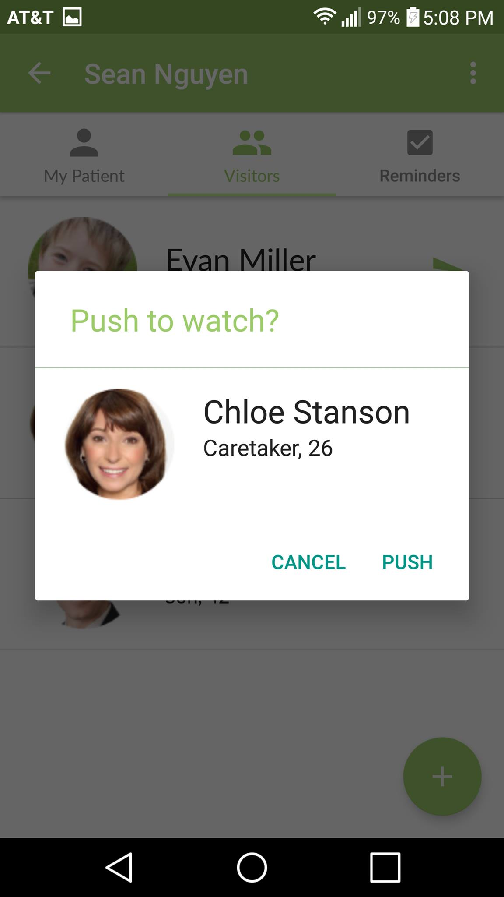
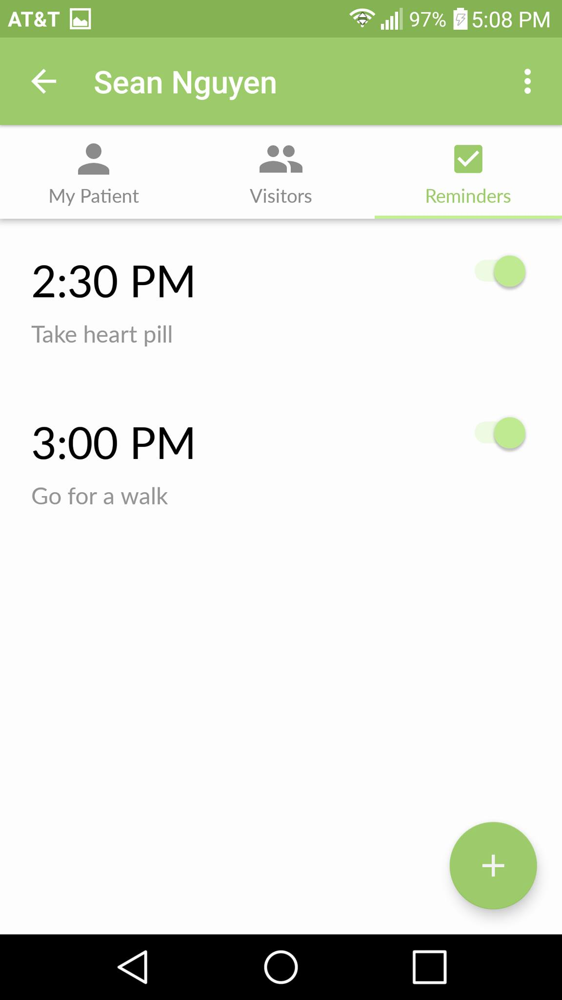
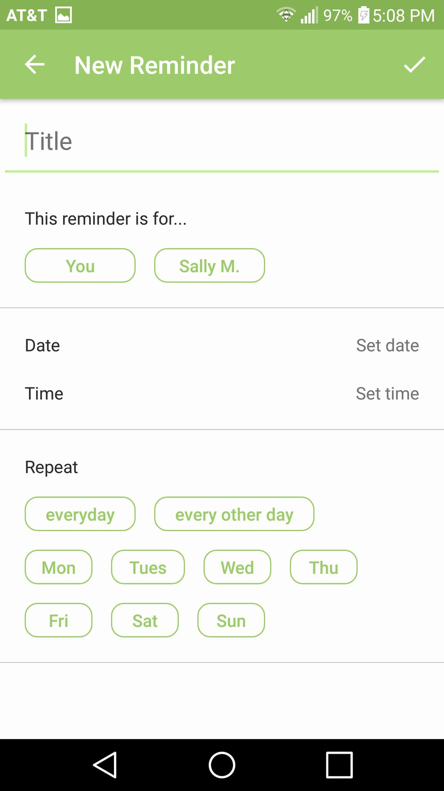

# Ally
*Alzheimer's with Autonomy*

**Ally** is an [Android](https://www.android.com/phones/) and
[Android Wear](https://www.android.com/wear/) application for early-stage
Alzheimer's caregivers and patients.

Being an Alzheimer's caregiver is extremely stressful. **Ally** delivers peace
of mind to caregivers through patient location tracking and medication
reminders delivered straight to the patient's smartwatch.

Patients are given a sense of autonomy: **Ally** allows patients to view visitor
profiles and contact their caregivers through a simple, non-intrusive
smartwatch app. It's there when you need it, and out of the way when you don't.

## Team Members

+ AnnaMarie Garlin
+ Annie Lo
+ Joel Graycar
+ Kunal Patel
+ Sean Nguyen

## Screenshots

### Selecting a patient

### Viewing patient status

### Tracking patient location

### Patient visitor profiles

### Sending visitor profile to patient

### Patient reminders

### Creating new reminders

